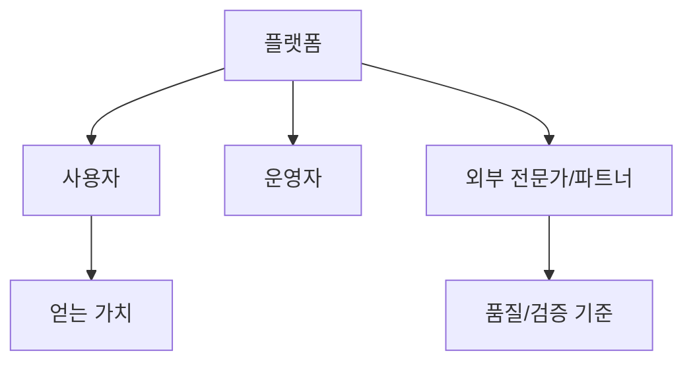
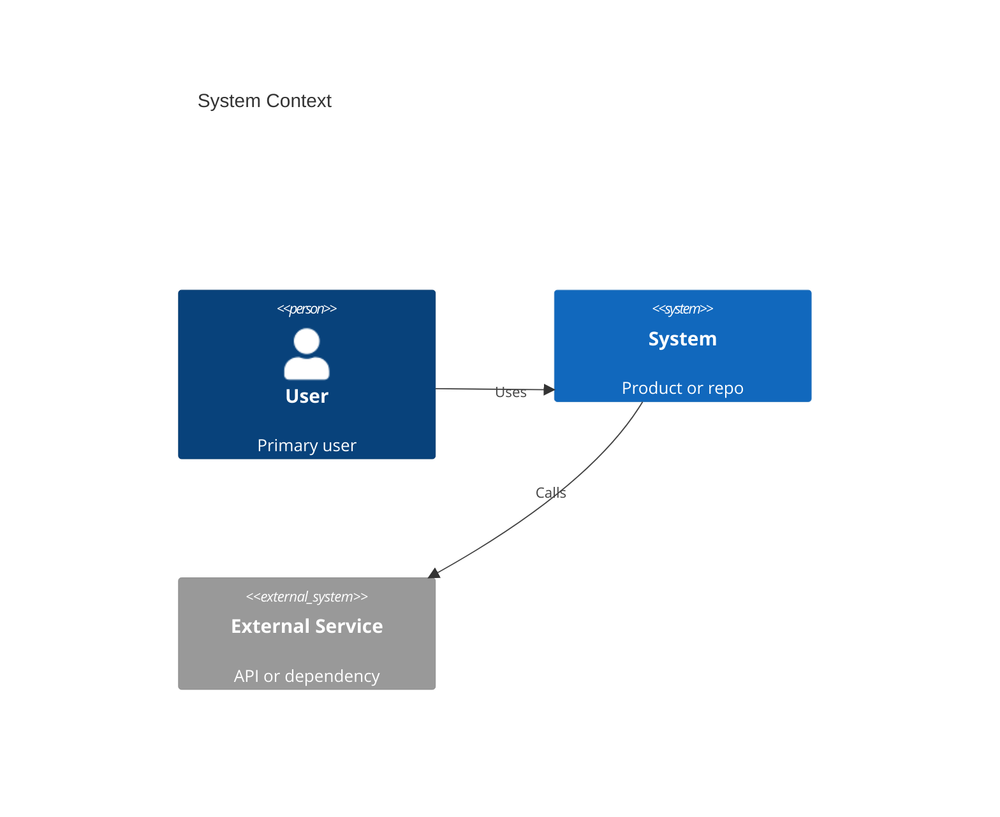
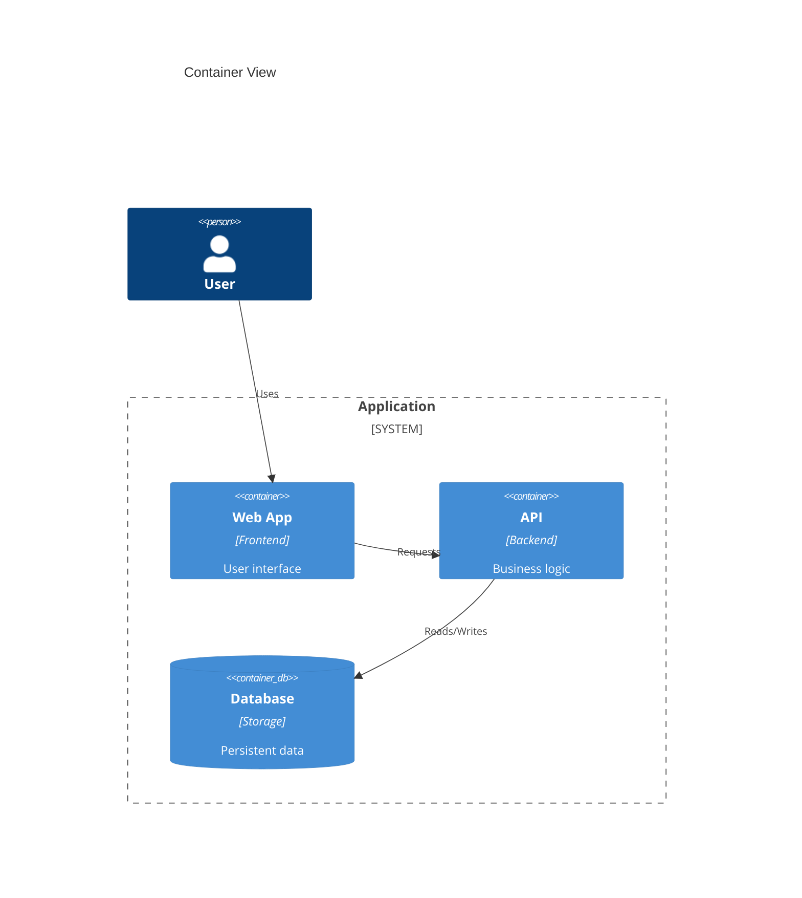
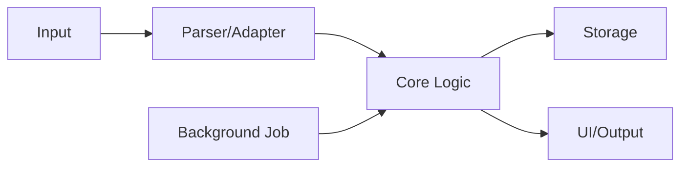

# MD Visual Workflow Patterns

## Core Loop

```text
1. Markdown source
2. visual-spec.json
3. HTML/CSS preview
4. PNG/SVG export or screenshot
5. Optional Mermaid/C4/D2 only when a diagram DSL is useful
6. Optional image-generation polish
7. Visual QA against the source
```

## Source Detail vs Visual Summary

Use Markdown as the detailed source of truth. Use `visual-spec.json`, HTML, and PNG/SVG as compressed visual summaries.

```text
source.md or main docs/*.md
  detailed explanation, examples, edge cases, rules

visual-spec.json
  core message, short labels, section structure

preview.html / preview.png
  quick review and presentation view
```

Do not force all nuance into the visual. If the reader needs the full explanation, point them to the Markdown source.

## Visual Spec JSON

Use `visual-spec.json` as the stable bridge between rough notes and rendered visuals. It should describe what to draw, not how to implement every pixel.

The user usually should not write this JSON by hand. They can write rough Markdown or plain text, then the agent creates `visual-spec.json` as the first structured draft.

### Minimum User Input

This is enough to start:

```md
# 만들고 싶은 이미지

어떤 서비스를 설명하는 이미지가 필요함.

보는 사람:
정부지원사업 심사위원

핵심 메시지:
사용자는 무료로 시작하고, 유료 분석과 답변권에서 BM이 생긴다.

보여주고 싶은 흐름:
1. 질문에 답한다
2. 기준표가 만들어진다
3. 요청 글을 남긴다
4. 전문가가 답변한다
5. 받은 문서를 AI가 분석한다

주의:
직접 추천처럼 보이면 안 된다.
무료/유료 경계를 명확히 보여주고 싶다.
```

From that, create a minimal visual spec first:

```json
{
  "title": "서비스 핵심 흐름",
  "mode": "idea",
  "audience": "정부지원사업 심사위원",
  "message": "사용자는 무료로 시작하고, 유료 분석과 답변권에서 BM이 생긴다.",
  "sections": [
    {
      "type": "flow",
      "title": "이용 흐름",
      "items": [
        {"label": "질문 답변", "badge": "무료", "description": "사용자의 상황과 기준을 정리"},
        {"label": "기준표 생성", "badge": "무료", "description": "원하는 방향을 보기 쉽게 정리"},
        {"label": "요청 글 작성", "badge": "무료", "description": "기준표를 바탕으로 상담 요청"},
        {"label": "전문가 답변", "badge": "유료", "description": "기준을 지키는 전문가가 답변"},
        {"label": "문서 AI 분석", "badge": "유료/크레딧", "description": "받은 문서를 표로 정리하고 검수"}
      ]
    }
  ],
  "notes": [
    "직접 추천처럼 보이지 않게 표현한다.",
    "무료/유료 경계를 명확히 표시한다."
  ]
}
```

```json
{
  "title": "서비스 핵심 흐름",
  "subtitle": "사용자가 기준을 찾고, 답변과 설계서를 검수하는 과정",
  "mode": "idea",
  "audience": "정부지원사업 심사위원",
  "message": "사용자는 무료로 시작하고, 유료 분석과 설계사 답변권에서 BM이 생긴다.",
  "theme": {
    "tone": "public-sector proposal",
    "accent": "#2563eb",
    "secondary": "#16a34a"
  },
  "sections": [
    {
      "type": "flow",
      "title": "고객 흐름",
      "items": [
        {
          "label": "기준 찾기",
          "badge": "무료",
          "description": "MBTI처럼 질문에 답해 원하는 보장 기준을 정리"
        },
        {
          "label": "요청 글 작성",
          "badge": "무료",
          "description": "내 기준표를 바탕으로 설계사에게 요청"
        },
        {
          "label": "설계서 분석",
          "badge": "유료/크레딧",
          "description": "받은 설계서를 AI가 표로 정리하고 검수"
        }
      ]
    },
    {
      "type": "cards",
      "title": "수익 모델",
      "items": [
        {
          "label": "설계사 답변권",
          "description": "기준을 지키는 설계사만 유료로 답변"
        },
        {
          "label": "고객 분석 크레딧",
          "description": "설계서 AI 분석 횟수 기반 과금"
        }
      ]
    }
  ],
  "notes": [
    "보험상품 직접 추천처럼 보이지 않게 표현한다.",
    "이미지에는 너무 긴 문장을 넣지 않는다."
  ]
}
```

### Visual Section Types

- `flow`: 단계가 순서대로 이어지는 흐름. 아이디어, BM, 사용자 여정에 적합.
- `cards`: 여러 장점, 기능, 사회적 가치, 리스크를 나란히 보여줄 때 적합.
- `comparison`: Before/After, 기존 방식/우리 방식 비교에 적합.
- `lanes`: 고객/운영자/파트너처럼 주체별 흐름을 나눌 때 적합.
- `timeline`: 마일스톤, MVP, 로드맵에 적합.

## Three-Layer Product Explanation

Use this structure when explaining a service, repository, or vibe-coded app that needs to be understandable from big picture to implementation detail.

```text
service-intro
  처음 보는 사람에게 왜 필요한 서비스인지 설명

user-manual
  실제 사용자가 무엇을 보고 누르는지 설명

developer-handoff
  개발자와 에이전트가 어디를 고치고 이어갈지 설명

plain-language-glossary
  일반인이 막힐 용어를 쉬운 말, 예시, 비교로 설명
```

Recommended folder layout:

```text
docs/visuals/<product>-service-intro/
docs/visuals/<product>-user-manual/
docs/visuals/<product>-developer-map/
docs/visuals/<product>-glossary/
```

Each folder should keep:

```text
source.md
visual-spec.json
exports/*-preview.html
exports/*-preview.png
```

If the glossary is part of a broader document package, also create a top-level Markdown glossary such as:

```text
docs/09_plain_language_glossary.md
```

The top-level glossary should be more detailed than the visual `source.md`. The visual `source.md` is a concise bridge into `visual-spec.json`.

### Service Intro Spec

```json
{
  "title": "서비스 소개",
  "subtitle": "처음 보는 사람이 한 번에 이해할 한 줄",
  "mode": "service-intro",
  "audience": "서비스를 처음 보는 팀원, 투자자, 사용자",
  "message": "왜 이 서비스가 필요한지와 무엇이 쉬워지는지 보여준다.",
  "sections": [
    {
      "type": "comparison",
      "title": "문제와 해결",
      "columns": [
        {"label": "문제", "description": "현재 사용자가 겪는 불편", "points": ["복잡함", "반복 판단", "기록 부재"]},
        {"label": "해결", "description": "서비스가 바꾸는 점", "points": ["흐름 제공", "판단 보조", "다음 행동 연결"]}
      ]
    },
    {
      "type": "flow",
      "title": "핵심 흐름",
      "items": [
        {"label": "시작", "description": "사용자가 처음 하는 일"},
        {"label": "정리", "description": "서비스가 복잡한 것을 정리"},
        {"label": "판단", "description": "사용자가 선택"},
        {"label": "결과", "description": "다음 행동으로 연결"}
      ]
    }
  ]
}
```

### User Manual Spec

```json
{
  "title": "기능별 사용설명서",
  "subtitle": "처음 켜서 결과를 확인하기까지",
  "mode": "user-manual",
  "audience": "실제 사용자",
  "message": "사용자가 무엇을 보고 누르면 되는지 설명한다.",
  "sections": [
    {
      "type": "flow",
      "title": "전체 사용 흐름",
      "items": [
        {"label": "입력", "description": "필요한 기본값을 넣는다."},
        {"label": "선택", "description": "원하는 작업을 고른다."},
        {"label": "확인", "description": "결과를 읽는다."},
        {"label": "액션", "description": "좋음, 싫음, 보류처럼 판단한다."},
        {"label": "다음", "description": "다음 작업으로 이어간다."}
      ]
    },
    {
      "type": "cards",
      "title": "기능별 의미",
      "items": [
        {"label": "기능 A", "description": "언제 쓰고 어떤 결과가 나오는지"},
        {"label": "기능 B", "description": "사용자가 눌렀을 때 바뀌는 것"}
      ]
    }
  ]
}
```

### Developer Handoff Spec

```json
{
  "title": "개발자용 기술 지도",
  "subtitle": "다음 개발자가 구조와 남은 작업을 빠르게 찾기 위한 지도",
  "mode": "developer-handoff",
  "audience": "개발자와 에이전트",
  "message": "제품 기능과 기술 경계를 분리해 보여준다.",
  "sections": [
    {
      "type": "comparison",
      "title": "제품 기능과 기술 경계",
      "columns": [
        {"label": "제품 기능", "description": "사용자에게 보이는 흐름", "points": ["화면", "기능", "결과"]},
        {"label": "기술 경계", "description": "코드와 데이터의 책임", "points": ["UI", "API", "저장소", "운영"]}
      ]
    },
    {
      "type": "lanes",
      "title": "시스템 지도",
      "lanes": [
        {"label": "화면", "steps": [{"label": "페이지", "description": "사용자가 보는 화면"}]},
        {"label": "API", "steps": [{"label": "엔드포인트", "description": "요청 처리"}]},
        {"label": "데이터", "steps": [{"label": "저장소", "description": "현재 저장 경계"}]},
        {"label": "운영", "steps": [{"label": "배포/보안", "description": "남은 gate"}]}
      ]
    }
  ]
}
```

### Plain-Language Glossary Source Pattern

Use this when terms may block non-specialist readers. Include terms that seem obvious to specialists if a general reader might not know them.

```md
# 쉬운 용어 정의서

## Why

이 문서는 비전문가, 기획자, 개발사가 같은 단어를 같은 뜻으로 이해하게 하여 화면 설계와 개발 기준이 흔들리지 않도록 돕는다.

## 먼저 이것만 알면 된다

| 용어 | 쉬운 비유 |
|---|---|
| SKU | 쇼핑몰이나 물류에서 구분하는 판매 코드 |
| BOM | 제품을 만드는 재료표 |
| Variant | 제품 정보가 달라져 따로 관리해야 하는 버전 |
| LOT | 같은 조건으로 만들어진 생산 묶음 |
| Snapshot | QR에 붙일 확정본 |

## 일반인이 특히 헷갈리는 용어 자세히 풀기

### SKU

SKU는 Stock Keeping Unit의 줄임말이다. 한국어로는 재고 관리 단위다.
같은 티셔츠라도 흰색 M, 흰색 L, 검정 M은 쇼핑몰이나 창고에서 다른 SKU로 볼 수 있다.

### BOM

BOM은 Bill of Materials의 줄임말이다. 쉽게 말해 제품 재료표다.
티셔츠라면 원단, 라벨, 포장 비닐, 종이 택 같은 항목이 BOM에 들어간다.

### Variant

Variant는 DPP에 보여줄 데이터가 달라져서 따로 관리해야 하는 제품 변형이다.
색상이나 사이즈가 다르다고 무조건 Variant는 아니다. BOM, 인증, 원산지, 탄소값, 포장재가 달라질 때 Variant로 볼 수 있다.

### LOT

LOT는 같은 조건으로 한 번에 생산된 묶음이다. 식품이나 화장품의 제조번호, 로트번호와 가깝다.

## 헷갈리는 용어 비교

| 묶음 | 쉬운 구분 |
|---|---|
| Product Case vs SKU | Product Case는 진단 시작 단위, SKU는 판매·재고 단위 |
| Option vs Variant | Option은 선택값, Variant는 DPP 데이터가 달라지는 변형 |
| BOM vs BOM Revision | BOM은 재료표, BOM Revision은 재료표의 버전 |
| LOT vs Serial | LOT는 생산 묶음, Serial은 개별 제품 번호 |
| Draft vs Snapshot | Draft는 수정 중인 데이터, Snapshot은 QR에 붙일 확정본 |
```

### Plain-Language Glossary Visual Spec

```json
{
  "title": "쉬운 용어 지도",
  "subtitle": "처음 듣기 어려운 말을 쉬운 예시로 맞추는 용어 정리",
  "mode": "glossary",
  "audience": "개발사, PM, 기획자, 비전문가",
  "message": "용어는 판매 코드, 재료표, 제품 변형, 생산 묶음, 확정본을 구분하기 위한 약속이다.",
  "sections": [
    {
      "type": "cards",
      "title": "먼저 이해해야 할 용어",
      "items": [
        {"label": "SKU", "badge": "판매 코드", "description": "쇼핑몰·창고에서 상품을 구분하는 재고 관리 코드"},
        {"label": "BOM", "badge": "재료표", "description": "제품을 만드는 자재, 성분, 부품, 포장재 목록"},
        {"label": "Variant", "badge": "제품 변형", "description": "보여줄 데이터가 달라지는 제품 갈래"},
        {"label": "LOT", "badge": "생산 묶음", "description": "같은 조건으로 한 번에 만들어진 생산 묶음"}
      ]
    },
    {
      "type": "comparison",
      "title": "가장 헷갈리는 구분",
      "columns": [
        {"label": "Product Case", "badge": "진단 시작", "description": "DPP 작업을 시작하는 대표 제품 파일", "points": ["빠른 등록 기준", "SKU보다 상위 개념"]},
        {"label": "Option / SKU", "badge": "선택·판매", "description": "색상, 사이즈, 판매·재고 코드", "points": ["후속 단계에서 연결", "DPP 분리 기준은 아님"]},
        {"label": "Variant", "badge": "DPP 분리", "description": "DPP 데이터가 달라질 때 나누는 변형", "points": ["BOM 차이", "인증·원산지 차이", "탄소값 차이"]}
      ]
    }
  ],
  "notes": [
    "Markdown glossary is the detailed reference.",
    "HTML/PNG is only the core term map."
  ]
}
```

## Idea Mode Templates

Use idea mode when the goal is to explain a product, grant application, service flow, business model, or social value. The best idea diagrams are readable without development context.

### Problem To Solution Visual Spec

```json
{
  "title": "문제에서 해결까지",
  "mode": "idea",
  "message": "복잡한 판단을 사용자가 이해 가능한 기준과 리포트로 바꾼다.",
  "sections": [
    {
      "type": "flow",
      "title": "핵심 흐름",
      "items": [
        {"label": "사용자 문제", "description": "어디서부터 판단해야 할지 모름"},
        {"label": "기준 찾기", "description": "질문 리스트로 내 기준을 정리"},
        {"label": "AI 정리/검수", "description": "답변과 문서를 표준화"},
        {"label": "이해 가능한 리포트", "description": "표와 질문으로 확인"},
        {"label": "다음 행동", "description": "상담, 보류, 재검토 결정"}
      ]
    }
  ]
}
```

### Optional Mermaid Problem To Solution


### Optional Mermaid Free And Paid BM


### Optional Mermaid Stakeholder Map



## Repo Mode Templates

Use repo mode when the goal is to help a developer, operator, or future agent understand a codebase or workflow. Prefer C4 for boundaries and Mermaid for sequences or lifecycle flows.

### Repo Visual Spec

```json
{
  "title": "레포 이해 지도",
  "mode": "repo",
  "audience": "다음 작업을 이어받는 개발자 또는 에이전트",
  "message": "무엇이 어디에 있고, 어떤 흐름으로 동작하며, 다음에 무엇을 봐야 하는지 보여준다.",
  "sections": [
    {
      "type": "cards",
      "title": "주요 영역",
      "items": [
        {"label": "사용자 화면", "description": "사용자가 직접 만지는 페이지와 컴포넌트"},
        {"label": "API/서버", "description": "요청 처리와 권한 검증"},
        {"label": "데이터", "description": "DB, 파일, 외부 서비스 연결"}
      ]
    },
    {
      "type": "flow",
      "title": "대표 요청 흐름",
      "items": [
        {"label": "입력", "description": "사용자/작업자가 값을 넣음"},
        {"label": "검증", "description": "권한과 데이터 형식 확인"},
        {"label": "처리", "description": "핵심 로직 실행"},
        {"label": "저장/출력", "description": "DB 저장 또는 UI 표시"}
      ]
    }
  ]
}
```

### C4 Context



### C4 Container



### Repo Workflow



## Image Prompt Skeleton

Use this after the diagram source is stable:

```text
Create a clean Korean infographic based on the attached source diagram.
Keep the same structure, arrows, and exact labels.
Do not add new text.
Use a white background, restrained blue/green accent colors, clear section titles, and professional public-sector proposal style.
All Korean text must be spelled exactly as provided.
If text accuracy is uncertain, prioritize the source diagram layout over decorative styling.
```

## HTML Preview Command

Visual spec to HTML:

```bash
python3 /Users/fw_m1/.claude/skills/md-visual-workflow/scripts/render_visual_spec_html.py \
  --input visual-spec.json \
  --output exports/visual-preview.html
```

Markdown document to HTML:

```bash
python3 /Users/fw_m1/.claude/skills/md-visual-workflow/scripts/build_visual_html.py \
  --input source.md \
  --output exports/source-preview.html \
  --title "Preview Title" \
  --mode idea
```
