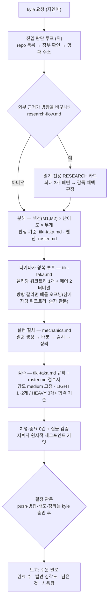

# Orca Conductor — Kyle 지휘 하네스 (코어)

## Why

여러 AI 코딩 도구를 병렬로 돌리되, Kyle의 안전 원칙(승인 없는 push/삭제 금지, 검수 후 병합)을 지키는 지휘 절차를 표준화한다. 이 파일은 항상 지켜야 할 코어(안전 규칙 + 진입 루프 + 흐름 지도)만 담고, 상세 절차는 `references/`에서 실행 직전에 읽는다.

## 참조 파일 지도 — 해당 패턴 실행 전 반드시 읽기

| 파일 | 내용 | 읽는 시점 |
|---|---|---|
| `references/roster.md` | 엔진 카탈로그(명령의 단일 진실) + 역할 편성표(발탁·effort·폴백·쿼터 — **"누가"**) | 일꾼/검수자 편성 전 |
| `references/mechanics.md` | 공통 장비: 일꾼 생성→배분·감시(우편함 규칙)→사용량→정리 (전 패턴 공유) | 판 세팅·감시 전 |
| `references/standard-flow.md` | 섹션 분해→가재 섹션 검수→보고 (대량 작업용) | 섹션 단위 대량 작업 전 |
| `references/tiki-taka.md` | 유일한 왕복 루프 + **검수 규칙 원본**(라운드 사다리·LIGHT/HEAVY·래칫) + 배틀 오프닝 + 병렬 랠리 규칙 — **"어떻게"** | **모든 구현 판 시작 전** |
| `references/commands.md` | 명령어 치트시트 + 조립 공식 | 필요 시 |
| `references/incident-log.md` | 사고 기록 연대기(append-only) — 규칙의 "왜"가 궁금할 때, 새 사고를 겪었을 때 여기에 추가 후 해당 절차 파일에 규칙 박제 | 새 사고 발생 시 / 회고 시 |
| `references/rally-log.md` | 랠리 데이터 대장(append-only) — 라운드별 오류 종류·횟수·수렴·전환 이벤트 효과 축적 (모델 선택 최적화용, 2026-07-20 kyle 지시) | **랠리 종결 시 기록 의무** / 편성 판단 시 참고 |
| `references/research-flow.md` | 외부 사례가 설계를 바꿀 수 있는지 판정하고 읽기 전용 리서치 카드를 구현 앞에 연결 | 구현 카드 생성 전 |
| `references/routing-observability.md` | 모델 점수 학습용 append-only 실행 원장 — 선택·발령·완료는 스크립트 자동 기록, 수기는 검수 판정·커밋 2개 | 수기 이벤트(검수·커밋) 기록 전 |
| `references/routing-exploration.md` | 안전한 작업의 최대 10%에서 대체 모델 조합을 실제 발령하는 제한적 탐색 규칙 | 탐색 비율·위험 표식 설정 전 |
| `references/development.md` | 새 세션이 Git worktree를 다시 찾고 상대경로로 작업자를 인계하는 개발 규칙 | 스킬 자체 수정·재개 전 |
| `references/routing-events.schema.json` | 라우팅 JSONL 한 줄의 기계 검증 스키마 | 원장 작성기·집계기 구현/검증 시 |
| `scripts/watch-card.sh` | 카드 상태 감시 (run_in_background로 직접 실행, `&` 금지) | 대기 걸 때 |
| `scripts/watch-inbox.sh` | 판 명패 앞 우편함 감시 — escalation/decision_gate 등 카드 상태가 안 바뀌는 신호용, 카드 감시와 병행 | 대기 걸 때 |
| `scripts/select-routing-pair.sh` | PEP 723 환경으로 동적 라우터를 안전 실행하는 표준 진입점 | 구현·검수 편성 직전 |
| `scripts/select_routing_pair.py` | 현재 쿼터·불능 provider·작업 크기로 작업자+검수자 조합을 함께 점수화하는 내부 구현 | 라우터 수정·검증 시 |
| `scripts/routing_shadow.py` | 실제 발령은 유지하고 `taskClass`·하네스 적합도를 그림자 재점수화하는 관찰기 | 새 모델·하네스 실험 설계·검증 시 |
| `scripts/routing_exploration.py` | 명시적으로 켠 안전한 0~10% 슬롯에서만 대체 조합을 실제 선택하고 근거를 구조화하는 선택기 | 제한적 실제 탐색 구현·검증 시 |

## Orca 공식 가이드 동기화 (2026-07-27 갱신)

설치된 `orchestration`·`orca-cli` 스킬 파일은 더 이상 전체 가이드를 담지 않는 **발견용 스텁**이다. 버전 일치 전체 가이드는 실행 중인 Orca 바이너리가 제공한다.

- 오케스트레이션 규칙이 의심스럽거나 Orca 앱 업데이트 직후에는 `orca skills get orchestration`과 `orca skills get orca-cli`를 다시 읽고, 이 스킬의 references와 어긋나는지 대조한다.
- 어긋남을 발견하면 해당 reference를 고치고, 살아 있는 프로젝트 감독에게 아래 "실행 중 감독의 스킬 자동 갱신 금지" 계약대로 재독 통지한다.
- 2026-07-27 재동기화 적용 사항: (1) 수명주기 권한은 `taskId+dispatchId`를 실제 발령된 pane으로 검증 — terminal handle은 재시작 후 바뀌는 라우팅 메타데이터 (2) 유효한 `worker_done`은 카드+dispatch를 자동 completed 처리 — 뒤에 `task-update --status completed`를 붙이지 않는다(명시적 복구·재정의만 허용) (3) `check --peek`(읽음 소비 없이 미확인 확인)·`--all`(전체 이력) 추가 (4) `task-list --brief`(spec 160자 축약) — 감시 스윕에 사용 (5) worktree 생성은 kyle 명시 요청 또는 구체적 checkout·파일 충돌이 있을 때만 — 병렬·편의는 격리 사유가 아님. 우리 병렬 랠리의 worktree 격리는 "병렬 작업자 간 파일 범위 충돌 위험"이라는 구체적 사유를 카드 설계에 명시하는 방식으로 유지한다.

## 안전 규칙 (Stop Rule 라이트 — 항상 적용)

1. **검수 합격 단위는 지휘자가 자동 체크포인트 커밋한다 (2026-07-24 kyle 결정).** 치명·중요 0건과 요구된 실물 검증을 통과한 변경만, 소유 파일을 지정해 원자적으로 커밋한다. `git add -A` 금지, 작업자 커밋 금지. push·merge·배포는 kyle 승인 전 금지한다. **기존 이슈판 예외**: 이슈 기반 판은 검수 합격 시 랠리 브랜치 push + 이슈 코멘트(브랜치·SHA·검수 요약)까지 허용한다. 모두써티(moducerti_vibe 하위) 레포는 해당 레포 `dev-release` 브랜치 머지까지 자동이다. develop 합류(하루 1회)·main·이슈 close는 관문 뒤다. 단, 스키마·마이그레이션·보안·데이터 접촉, 스코프 이탈, 또는 라운드 사다리 소진이면 자동 진행을 멈추고 관문 대기한다. 모두써티 이슈판의 `🚧 개발중` 라벨·브랜치 코멘트·조직 보드 이동 자동화는 유지한다.
2. worktree 삭제·병합은 결정 관문(gate) 승인 후에만.
3. 일꾼 프롬프트에는 항상 "다른 파일 수정 금지 범위"와 "커밋 금지"를 명시한다.
4. 배분 전 사용량을 확인하고 `scripts/select-routing-pair.sh`로 작업자+검수자 조합을 함께 고른다. Python 파일을 `python3`로 직접 실행하지 않는다. 429·기동 실패 provider는 후보에서 빼되, 고정된 다음 칸으로 이동하지 않고 남은 조합 전체를 다시 점수화한다. 실제 탐색은 `references/routing-exploration.md`의 안전 범위와 `0..10%` 상한을 지키며 명시적으로 켠 카드에서만 허용한다.
5. 검수자 결과는 보고만 받는다. 수정 권한은 일꾼에게 재배분한다.
6. Orca 내부 **프로젝트 감독**은 직접 코딩하지 않는다 — **진단·실측·검증 스크립트 작성도 코딩이다. 카드로 만들어 배분한다.** 프로젝트 감독은 설정·스폰 가능한 전담 세션이며, 기본값은 `gpt-5.6-sol` low다. 한 판의 카드 발령·상태 변경·검수 연결·합격 체크포인트 커밋은 해당 프로젝트 감독만 수행하는 단일 작성자 계약이다.
   - **조사 경계선 (2026-07-15 kyle 결정)**: 대상 파일을 아는 상태에서 **몇 개 파일 읽으면 끝나는 단순 대조**(diff·로그·장부·특정 함수 확인)는 지휘자 직접 허용. **원인을 모르는 상태에서 시작하는 탐색**(원인 추적, 코드 서칭, DB 실측)은 조사 카드로 배분한다 (`references/mechanics.md`의 조사 카드 계약). 프리셋은 roster.md의 조사 편성을 따른다.
   - 조사 카드는 코드 변경이 없으므로 별도 검수 없이 **지휘자가 보고의 근거(파일:줄)를 대조 확인**으로 종결한다. 단 조사 결과가 파괴적 결정(삭제·마이그레이션·초기화)의 근거가 되면 2차 의견 카드 1개를 추가한다.
7. **내장 순찰(orchestration run) 사용 금지 (2026-07-13 kyle 결정)** — run은 카드-워크트리 짝을 모르고 "빈 일꾼 아무나"에게 배분하므로, 멀티 랠리 판에서 엉뚱한 브랜치에 수정이 들어갈 수 있다. 배분은 항상 지휘자 수동 + `watch-card.sh` 감시로 한다. (근거 기록: `.staging/run-mode.md`)
8. **중계기는 후임이 실제로 순찰을 시작한 뒤에만 선임을 정지한다 (2026-08-04 교대 실패 박제).** 순서는 `후임 생성 → 공식 roster 등록 확인 → 기동 확인 → 실제 순찰 1회 확인 → 그다음 선임 정지`다. 어느 한 단계라도 확인되지 않으면 **선임을 살려 둔다** — 후임 없이 선임을 종료하면 판이 감시 공백에 빠진다. 인계는 무상태여야 한다: cursor + append-only 로그 + project/board/run/super-run만 넘기고 선임의 대화 문맥·판단 이력은 넘기지 않는다. 교대 기준은 **판단 품질 저하 / 판 경계 / context 80% 초과** 셋뿐이며, 그 전에는 압축이 기본이다. 상세 절차와 현재 임시 운영은 `references/mechanics.md`의 "중계기 교대(handover) 계약".

## 외부 감독 프로그램 ↔ 프로젝트 감독 계약

- **외부 감독 프로그램**은 Orca 밖에서 kyle과 대화하고 여러 프로젝트를 조율하는 상위 제어면이다. Codex Desktop, Codex CLI, Claude Code, 자체 앱 등 하네스 종류를 고정하지 않는다.
- 외부 감독은 새 작업을 카드 후보로 구조화하고, 충돌을 확인하고, 결정·우선순위·중단 지시를 프로젝트 감독에게 전달한다. 인계 후에는 그 판의 active/ready 카드 발령·상태 변경·체크포인트 커밋을 직접 하지 않는다.
- **프로젝트 감독**은 Orca 내부의 유일한 작성자다. 작업자·검수자 티키타카, 안전 발령, 정체 복구, 합격 커밋, 다음 ready 카드 진행을 담당한다.
- 외부 감독의 사용자 대화는 감시보다 우선한다. 외부 감독은 정상 진행을 이유로 장시간 foreground wait를 하지 않고, 필요할 때 즉시 반환되는 짧은 조회 1회만 수행한다. 상세 감시는 companion과 luna-high 중계기가 맡는다.
- 정상 진행은 외부 감독에게 보고하지 않는다. 전체 완료, 치명 오류, 반복 실패, 프로젝트 간 충돌, kyle 결정이 필요한 관문만 올린다.
- **실행 중 감독의 스킬 자동 갱신 금지 가정**: `orca-conductor`의 SKILL·reference·script를 수정해도 이미 실행 중인 프로젝트 감독 문맥에는 자동 반영되지 않는다. 스킬 수정자는 살아 있는 프로젝트 감독 handle을 확인해 변경 파일과 핵심 규칙을 재독하라는 갱신 통지를 직접 보낸다. 진행 중 카드를 중단하지 말고 다음 안전한 카드 경계부터 적용하게 하며, 재독 확인을 한 줄로 받는다. 살아 있는 감독이 없으면 통지를 생략한다.

## 완료 보고 3종 — 터미널은 보고가 아니다 (2026-08-10 실사고)

**모든 작업·검수 카드의 완료 절차는 셋이다.**
```
1  결과 전문을 파일에 쓴다        <워크트리>/.staging/result-<카드>.md
2  worker_done 편지를 보낸다      --to run:<판 Run>   (한 줄 요약 + 파일 경로)
3  터미널에는 한 줄 요약만
```

**터미널은 아무도 깨우지 않는다. 파일은 찾을 수 있고 편지는 깨운다.**

이유 셋 — 셋 다 실행기와 무관하게 성립한다.
```
1  터미널 출력은 아무도 깨우지 않는다        결과가 나와도 감독은 모른다
2  결론을 사람이 찾아야 한다                 검수 1건이 1408줄이었다
3  하네스마다 출력 형식이 다르다              파일·편지는 실행기가 바뀌어도 같은 모양이다
```

**정정 (2026-08-10)**: 이 규칙을 처음 적을 때 근거를 `터미널 기록이 스크롤로 사라진다`라고 썼는데 **틀렸다.** 슈퍼가 `terminal read` 를 옵션 없이 불러 6줄만 받고 그렇게 판단했다. 실제로는 **`--cursor <oldestCursor> --limit <n>` 으로 읽으면 2000줄(내용 1408줄)이 그대로 있었다.** kyle 이 `터미널에 기록 남아있던데` 라고 물어서 드러났다.
→ **`terminal read` 는 옵션 없이 쓰면 마지막 몇 줄만 준다.** 긴 응답을 보려면 `--limit` 을, 앞부분까지 보려면 응답의 `oldestCursor` 를 `--cursor` 로 넘긴다. `truncated` 필드로 잘렸는지 확인한다.

실사고: 슈퍼가 검수 카드에 `결과는 터미널에 남기고 대기해라` 라고 썼다. 검수는 155초 동안 정상 수행됐는데 **아무도 깨어나지 않았다.** 슈퍼는 마지막 한 줄(`TPS 47.5 tok/s`)만 보고 결과가 없다고 판단해, 두 번 요청해서야 파일로 받아냈다. kyle 이 `끝난 거 같은데 보고를 안 한 듯` 이라고 물어서 드러났다.

이건 같은 날 아침 `멈추는 질문은 편지로, 터미널 출력은 아무도 안 깨운다` 를 판에 지시해 놓고 **완료 보고에는 적용하지 않은 것**이다. **질문이든 결과든, 누군가 받아야 하는 것은 편지로 간다.**

## 에이전트 실행기는 conductor 스킬을 참조한다 (2026-08-10 신설 — 여기 다시 적지 않는다)

작업자를 실제로 띄우는 CLI(codex·omo·claude)의 **실행법·필수 플래그·검증법·특이사항**은 `conductor` 스킬에 있다.

```
conductor/references/agent-runners.json
```

**여기(orca-conductor)에 복제하지 않는다.** 축이 다르기 때문이다 — Orca 는 판이 사는 **호스트**이고, codex·omo 는 작업자를 띄우는 **실행기**다. 실행기는 호스트가 무엇이든 똑같아서 Rottie 쪽도 같은 파일을 본다.

**작업자를 띄우기 전에 그 파일의 해당 실행기 항목을 읽는다.** 특히 `required_flags` 와 `verify`. 실행기마다 **라우터가 정한 것을 뒤집는 동작**이 있고(2026-08-10 실측: codex 는 지시 주입, omo 는 모델 갈아타기), 그걸 모르면 라우팅이 무의미해진다.

## 라우팅이 다루는 것과 안 다루는 것 (2026-08-10 kyle 확정)

```
라우팅 대상 — routing-providers.json 이 정한다
  developer    구현
  reviewer     검수
  researcher   간단한 조사

라우팅 대상 아님 — 상시 결정(슈퍼 또는 kyle)
  project-supervisor   감독. 판정 역할이므로 developer 계열에서 고르지 않는다.
                       품질 높은 판정 계열에서 낮은~중간 노력.
  relay                중계기. 상시 결정(luna). 순찰이라 소모가 크므로 낮은 노력.
  companion / kicker   셸 스크립트. 모델 자체가 없다.
```

**카드를 수행하는 역할만 라우터가 고른다. 판을 굴리는 장치는 라우터 밖이다.**

- **중계기·companion·kicker 를 띄우는 데 라우터를 찾지 마라.** 편성이 필요하면 슈퍼에게 묻는다.
- **작업자·검수자 발령은 `routing-providers.json` 의 `command` 를 글자 그대로 쓴다.** `-p orca` 와 `--model` 과 노력 셋 중 하나라도 빠지면 발령하지 않는다. **발령 후 `ps` 로 실제 명령줄에 `-p orca` 가 있는지 확인한다** — 프로필이 안 붙으면 무거운 MCP 가 따라 뜬다(실측: 붙으면 증가 0, 없으면 3).
- 실사고(2026-08-10): 슈퍼가 이 구분을 헷갈려 **중계기 편성을 kyle 결정으로 떠넘겼다.** kyle 이 `중계기는 라우터와 무관`이라고 지적해 드러났고, 슈퍼가 직접 띄워 해결했다. 범위 선언은 `references/routing-providers.json` 의 `_scope` 에 박혀 있다.

## 기록 보고 규칙 — "박았습니다"는 보고가 아니다 (2026-08-10 kyle 지적)

무언가를 기록했다고 보고할 때는 **어디에 적었고 누가 읽는지**를 함께 적는다. `표준에 넣었다`, `규칙으로 박았다`, `문서화했다`만 쓰면 받는 쪽은 그것이 실재하는지, 실제로 적용되는지 확인할 수 없다.

```
나쁜 보고   "규칙으로 박았습니다"
좋은 보고   "mechanics.md:142 에 적었습니다 (작업자 발령 전 내가 읽는 곳)"
```

**형식**: `<파일 경로>:<줄> — <누가 언제 읽는가>`

**왜**: 이건 이 판들이 계속 잡아 온 부류의 보고 판본이다. 어떤 규칙이 **문서에 있는 것**과 **실제로 적용되는 것**은 다르고(`침묵하는 미적용`), 위치를 안 밝히면 그 둘을 구분할 방법이 없다. 위치를 적으면 받는 쪽이 **바로 열어서 대조**할 수 있다.

**적는 곳이 여럿이면 전부 적는다.** 같은 규칙이 여러 곳에 흩어지면 갈라지므로, 어디가 원본이고 어디가 사본인지도 밝힌다.

**기록 위치의 기본 배분**
```
판 운영 규칙·사고         이 스킬의 references/     감독이 판 돌릴 때 읽음
제품 결함·후속 작업        <저장소>/docs/TODO.md     나중에 그 저장소를 고칠 사람이 읽음
카드별 증거               .orca/evidence/<카드>/     검수·재현할 때 읽음
판 고유 지시              임명장 파일                이 판 감독만 읽음
```

## 진입 판단 루프 (kyle 규칙 — 어떤 배분/run보다 먼저)

0. **대상 레포가 Orca에 등록돼 있나?** (`repo list`) — 없으면 `repo add --path <절대경로>`로 등록하고 시작한다(명단 추가일 뿐 파일 무변경. Orca 재시작 후 명단이 비어 있을 수 있음 — 실측 2회).
1. **장부에 카드가 이미 있나?** (`task-list`) — 있으면 내 판인지 확인한다 (spec의 `[판:이름]` 접두사로 구분). 모르는 카드·다른 판의 신호는 건드리지 말고 kyle에게 묻는다. 이어받는 판이면 상태별로 재개한다.
2. **판 세팅 시 자기 우편함 주소를 확인한다** — 지휘자가 Orca 내부 터미널이면 자기 핸들이 곧 주소(자동), **외부 셸이면 더미 명패 + `dispatch --from` 필수** — 안 붙이면 그 판의 모든 보고가 엉뚱한 내부 터미널로 오배달된다(실측, mechanics.md "세션별 우편함 주소"). `[판:]` 접두사와 불개입 규칙은 잔재 신호용 마지막 방어선.
   - **명패 = companion 즉시 (현재 계약)**: `references/mechanics.md`의 project/board/role/Run 기반 `conductor-companion.sh` 명령을 Monitor(persistent)로 fire-and-forget 실행한다. 고정 handle 호출은 쓰지 않는다. bounded cursor patrol과 misrouted_human_decision 처리 규칙은 mechanics.md에 두고, 보고 계약의 원문은 `~/.claude/skills/super-conductor/references/adapter-contract.md`에 둔다.
3. **없으면 — 외부 리서치가 방향을 바꿀 수 있나?** `references/research-flow.md` 기준으로 판정한다. 해당하면 읽기 전용 RESEARCH 카드를 먼저 만들고, 프로젝트 감독이 결과를 채택·보류·기각한 뒤 구현 카드를 만든다. 해당하지 않으면 한 줄 생략 이유를 남기고 바로 카드 분해로 간다.
4. **지금 요청을 카드로 쪼갤 수 있나?** 쪼갤 수 있으면 `task-create`로 만든다 — **spec은 항상 `[판:<판이름>]` 접두사로 시작** (장부·우편함이 전역 공유라 다중 세션 지휘 시 구분 필수, mechanics.md). 애매하면 kyle에게 되묻는다. 카드 출처는 kyle 요청 또는 **레포 이슈**(`gh issue list`, 이슈 1건 ≈ 랠리 1개) — 이슈판도 흐름은 동일하다.
5. **카드가 생긴 뒤에야** 배분을 시작한다. 카드 0장 상태에서 시작하는 배분은 없다.

## 컨텍스트 절약 3칙 (2026-07-27 kyle 승인 — openapi-fix 판 실측: 감독 도구 출력의 42%가 낭비)

1. **스킬 문서는 첫 정독 1회 의무, 이후 재읽기는 "필요한 절만"** — 불확실하면 언제든 다시 봐도 되지만(몰라서 틀리는 것 방지 우선), 매 라운드 습관성 전문 재읽기 금지 (실측: 같은 4개 문서 전문 16회 재읽기 = 149KB ≈ sol 창의 10%+). 매 라운드 필요한 규칙 몇 줄은 카드 발령문에 박아 재조회 필요 자체를 줄인다.
2. **감독의 terminal read는 3경우만 + 항상 하단 tail 제한** — (a) dispatch-safe.sh가 PROMPT_DETECTED로 멈췄을 때 (b) 중계기 escalation의 최종 판정 (c) 보고 유실 복구. 생존·스타트·정체 확인은 스크립트와 중계기 몫이므로 감독이 중복으로 읽지 않는다. 읽을 때도 전체 스크롤백 금지, 하단 60줄 이내 (실측: 전체화면 read 9건 = 131KB 낭비).
3. **task-list는 --brief 강제** — 장부는 전역 공유라 전문 조회 1회가 수십 KB다. 특정 카드의 spec 전문이 필요하면 그 카드만 집어 조회한다.

## 흐름 지도



핵심 원칙 세 줄:

- **카드 설계가 품질 상한선** — 명세에 범위·금지·합격 기준을 다 박는다.
- **판단은 LLM, 잡일은 코드** — 대기·감시는 스크립트(토큰 0), 지휘자는 신호 올 때만 깨어난다.
- **부탁보다 구조** — 파일 충돌은 프롬프트가 아니라 워크트리 격리로 막는다.
