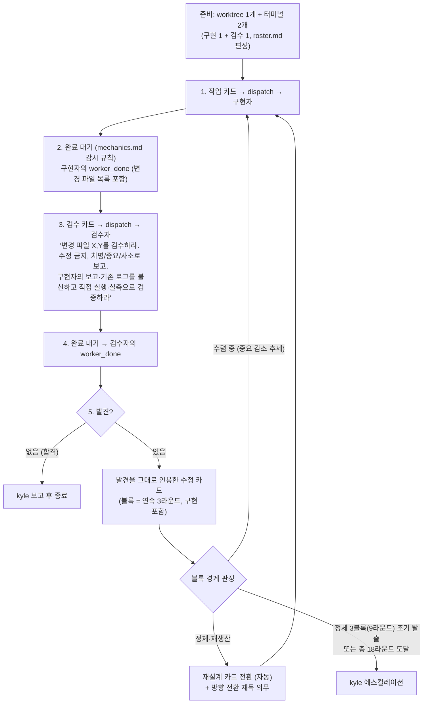

# 티키타카 루프 — 유일한 왕복 루프 + 검수 규칙 원본

모든 구현 판은 이 왕복 루프(구현↔검수)로 돈다. 방향이 갈릴 때만 1라운드를 배틀 오프닝(§배틀)으로 시작하며, 승자도 같은 루프에 합류한다. 역할 분리(2026-07-21 kyle 구조 개편): **"누가 하나"(엔진·폴백·쿼터) = roster.md, "어떻게 왕복하나"(사다리·검수 규칙) = 이 파일.**

지휘자는 외부 터미널, 구현과 검수는 Orca 안. **같은 워크트리에 두 터미널** — 검수자가 구현 파일을 직접 본다.

## 라운드 밖 3툴 (라운드로 세지 않음 — 2026-07-22 kyle 정의)

**라운드 = dev+review 왕복 1회.** 아래 3가지는 **검수 왕복이 없어** 라운드에 안 센다(사다리 18라운드 상한·블록 계산에서 제외). 라운드 카운트는 검수를 받는 왕복만이다.

1. **probe** — 폴백 복귀 판정용 쿼터/라우팅 확인 요청. `scripts/probe-codex.sh`. 발령 전 1회. (roster.md 복귀 판정 절)
2. **investigation (조사)** — 읽기 전용 조사 카드. 원인 추적·코드 서칭·실측. 코드 변경이 없어 검수 루프 없이 **지휘자가 근거(파일:줄) 대조로 종결**. (SKILL.md 조사 카드 계약, roster.md 조사 편성. 구 프리셋 표기 `recon-`은 역사적 잔재 — 새 표기는 `investigation`/`invst-`.)
   - 외부 사례·표준이 구현 방향을 바꿀 수 있는 조사는 `research-flow.md`의 RESEARCH 선행 카드다. 구현 라운드 전에 끝내고, 채택된 근거만 구현 카드에 옮긴다.
3. **micro-fix (마이크로 정정)** — 검수에서 나온 **사소/관찰(observation)급 1~2건**을 검수 왕복 없이 dev 수정 + 지휘자 대조로 종결. **치명/중요는 micro-fix 금지 — 반드시 정식 라운드(검수 왕복)로 돈다.** 조사 카드 종결 원리(코드 변경 검수 대신 지휘자 대조)를 사소 수정에 확장한 것. 라운드 사다리를 소모하지 않으므로 남발 금지(같은 카드에서 micro-fix가 3건 이상 쌓이면 검수 신뢰도 문제 — 정식 재검수로 승격).

## 기본 편성 (엔진 선택의 원본은 roster.md)

- 구현: roster 배분 원칙 — 작업 성격(표적 구현·프론트·구조 변경=`codex-glm52-medium`, 대규모 읽기·조사·그 외=`codex-kimi1m-low`, 잡일=`codex-glm52-medium`) + kimi pace 동적 라우팅 + 가용성 폴백 순서. 상세는 roster.md (2026-07-22 kimi/glm 균형 배분 반영)
- 검수: `codex-sol-medium` 새 세션 (강도 medium 고정)

## 라운드 사다리 (2026-07-22 kyle 개정 v3 — 라운드 정의 통일)

**라운드 = dev+review 왕복 1회** — 내용물이 구현이든 수정이든 재설계든 구분 없이 전부 동등한 라운드 1회다(특례 없음). **블록 = 연속 3라운드** — 따라서 블록1 = 구현+수정+수정, 블록2부터는 수정(또는 재설계) 3개. **총 상한 = 블록 6개 = 라운드 18개(구현 포함) 딱**. (v2까지는 "블록 = 수정 3라운드"로 구현 라운드를 블록 밖 특례로 뒀는데, 세는 기준이 둘이 되어 혼동 실사고 — 2026-07-22 kyle 정의로 통일. 부수 효과: 첫 수렴 판정이 한 라운드 빨라짐 — 구현 검수 기준점 + 수정 2회 추이면 판정 데이터 충분.) 블록 경계마다 지휘자가 수렴 여부로 다음 블록을 정한다:

- **수렴 중이면 방향 유지**: 치명 0 유지 + 중요 감소 추세면 재설계 없이 수정 카드 블록을 계속한다. **수렴 판정은 같은 검수 범위끼리만 비교** (델타↔전체 혼동 금지 — rally-log `rottie-m10` 관찰). 치명 재등장은 수렴이 아니다.
- **정체·재생산이면 재설계 전환 (자동 — kyle에게 묻지 않음)**: 발견 수가 안 줄거나 같은 부류 발견이 반복되면 패치 누적을 멈추고 접근 구조를 바꾸는 재설계 카드로 전환. 검수자의 수정 방향 제안이 있으면 구조 지시로 삼는다.
- **조기 탈출**: 재설계를 거쳐도 전선이 안 바뀌는 정체 블록 3연속(누적 9라운드)이면 총 상한을 기다리지 않고 kyle 에스컬레이션.
- **총 상한 18라운드 (연속 3라운드 × 6블록, 구현 포함)**: 수렴 중이라도 도달하면 kyle 에스컬레이션. (근거: rally-log `open-api` 10라운드·`rottie-m10` 13라운드 합격 — 둘 다 재설계가 발견의 전선을 바꾼 뒤 수렴. 구 사다리의 6라운드 에스컬레이션은 실제 합격 지점보다 일렀다)
- **방향 전환 재독 의무 (자가개선 반영)**: 재설계 전환(블록 경계)마다 다시 읽는다 — (1) `tiki-taka.md` 사다리·검수 규칙 (판 도중 개정된 규칙이 그 판에 반영되게) (2) `incident-log.md` 최근 항목 (3) `rally-log.md` 유사 성격 판의 전환 이벤트 효과. 재설계 카드에 "참고한 과거 판 한 줄"을 남긴다.
- 수정 카드: 검수 발견 전문(파일:줄)을 그대로 인용. 같은 편성 유지. 재설계 카드: 접근 구조를 바꾸는 카드.
- 예외: kyle이 준 라운드 한도가 있으면 그것 우선. 파괴적 결정·범위 변경은 라운드 무관 즉시 질문.
- **모델 교체는 라운드 실패의 자동 결과가 아니다** — 자동 교체는 roster의 가용성 폴백뿐. 그 외 교체(모델 능력 부족 정황이 명확할 때)는 지휘자 판단, 강등 금지. effort 오분류 정황(능력은 충분한데 깊이 부족)이면 교체 전에 같은 모델 effort 1단 승급을 먼저 1회. (근거 양면 실측: rally-log `rottie-tab-blank`=교체가 정답 / `rottie-m10`=재설계가 정답)

## 검수 규칙 (원본 — 2026-07-21 roster에서 이관)

**무검수 단독 편성은 없다.** 지휘를 걸었다는 것 자체가 검수받을 일이라는 뜻이다.

**무게(LIGHT/HEAVY)는 강도가 아니라 합격 기준 개수의 차이다** (검수 강도는 항상 medium — 2026-07-20 kyle v4, 근거: rally-log `rottie-tab-blank`·`rottie-m10` 검수 xhigh 비용 과다):

| 무게 | 합격 기준 |
|---|---|
| LIGHT (기본) | 1~2개 (정상 경로 + 가장 위험한 엣지). 1라운드 합격 기대 |
| HEAVY | 3개 이상 (정상 + 엣지 + 회귀). 합격까지 라운드 사다리로 왕복 |

HEAVY 조건 (하나라도 해당하면): 새 모듈/레이어/추상화 · 인증/보안/세션/권한 · 외부 연동(API/큐/결제/웹훅) · DB 스키마/마이그레이션 · 동시성/트랜잭션/캐시 무효화 · 도메인 경계 넘는 리팩터 · kyle "신중하게/꼼꼼히" 신호.

**래칫**: 애매하면 상위 등급. 작업 도중 HEAVY 사실이 드러나면 즉시 승급하고 LIGHT가 건너뛴 검증을 다시 한다 (강등 금지). 분류는 카드 설계 때 1회, 등급+한 줄 근거를 카드 spec에 기록.

- **실측 의무 (검수 카드에 항상 포함)**: "기존 보고·로그·증거를 전부 불신하라. 직접 실행·실측으로 확인하라." 같은 모델 검수가 버티는 비결은 이 evidence discipline이다.
- **재검수는 델타 범위**: 같은 랠리의 첫 검수만 전체 범위, 이후 재검수는 수정 지점 + 직접 인접 회귀 + 해당 발견의 재현 재실행만. 예외: 재검수에서 치명이 나오거나 수정이 재설계급이면 다음 검수는 다시 전체 범위 — 재설계는 옛 합격 근거를 무효화하므로 역대 발견 전부를 새 구조에서 재현 확인하고, 새 구조 자체가 만든 신규 결함 탐색도 포함한다.
- **검수 카드에 소스 수정 요구 금지 (2026-07-22 실사고)**: '검출력 확인용으로 마스킹/가드를 일부러 빼서 테스트 실패를 보라'는 돌연변이 검증을 검수 카드에 넣지 않는다 — 검수 전용·수정 금지와 충돌해 검수자가 막힌다(ask 승인 요청→연결 실패로 표류). 검출력 확인은 구현 카드(구현자 self-mutation)나 지휘자 몫. 검수자는 정적 검토·재실행·실측만.
- **이중 검수 금지**: 검수는 라운드당 정확히 1회. "검수 승급"은 별도 단계가 아니라 그 라운드 검수의 **범위 상향**(강도는 medium 그대로)이다. 발동 조건: 직전 수정이 재설계급 · 직전 검수에서 치명 · kyle "신중하게" 신호. 조건 없는 라운드의 합격이 곧 랠리 종결이며 합격 뒤 검수를 추가하지 않는다.
- **실물 표면 의무 (2026-07-13 실사고)**: 결과가 사용자 눈·실행 표면에 보이는 작업이면 LIGHT라도 합격 기준에 실물 증거 1개 이상(렌더된 화면·실제 HTTP 응답·실기 TUI 출력)을 포함한다. 코드 배선 추적 + 단위 테스트 통과만으로는 완료가 아니다. 일꾼이 표면을 못 보는 환경이면 확인 수단(playwright, curl)을 카드에 명시하고, 최종 실물 QA가 kyle 몫이면 보고에 명시.
- **검증 비용 규칙 (구현 카드 [검증] 절에 항상 포함)**: "작업 중에는 지금 수정하는 파일의 focused 테스트만 돌려라. 전체 테스트·타입 검사(tsc)·빌드는 작업이 끝난 뒤 각 1회만." (근거: rally-log `rottie-tab-blank` — 코드 몇 줄마다 전체 테스트+빌드 반복으로 라운드당 수십 분 소모)

### 운영 세칙

- 검수 합격 기준(예: "치명·중요 0건")은 시작 전에 카드 명세에 명시한다.
- **라우팅 원장 기록 (2026-07-27 자동화 개정)**: 편성 선택·발령·worker_done은 스크립트가 자동 append 한다(`routing_selected_auto`/`dispatch_auto`/`worker_done_auto` — routing-observability.md 2층 구조). **감독 수기는 2개만**: 검수 대조 뒤 `review_finished`, 체크포인트 직후 `checkpoint_committed`를 같은 커밋 턴에 레포 본체 `.orca/routing-events/<판>.jsonl`에 남긴다. 수기 이벤트 누락은 랠리 종결 전에 보완한다.
- **검수 합격 단위는 프로젝트 감독이 즉시 체크포인트 커밋한다 (2026-07-24 kyle 결정).** 치명·중요 0건과 요구된 실물 검증을 통과한 소유 파일만 지정해 커밋하고 SHA를 장부·보고에 남긴다. 작업자 커밋과 `git add -A`는 금지한다. push·merge·배포는 별도 관문이며, SKILL.md의 이슈판 자동 push 예외만 유지한다. 검수 통과분을 즉시 커밋하면 미커밋 누적분이 섞여 라운드별 diff 범위를 잃는 문제를 막는다.
- 도구 메타파일(`.gjc/` 등)은 커밋에서 항상 제외 — `git add -A` 금지, 파일 지정 add.
- **검수 카드 spec에 서브에이전트 계약 전파를 항상 포함**: "서브에이전트를 쓰면 그 프롬프트에도 읽기 전용·수정 금지 계약을 그대로 복사해 전달하라." (2026-07-19 실사고: 서브에이전트가 공유 워크트리를 수정)
- **검수 근거(evidence) 파일은 장소 지정 — 워크트리 밖에만 (2026-07-27 실사고, kyle 승인)**: 검수 근거 저장 자체는 장려하되, **검수 대상 워크트리 안에는 어떤 파일도 생성·수정 금지**다. 근거 파일은 레포 본체 `<레포루트>/.orca/evidence/<판>/<카드>/` 또는 `/tmp/orca-evidence/<판>/`에만 남긴다. 사유: 워크트리 안 생성은 (1) 다음 라운드 델타 검수의 git status/diff를 오염시키고 (2) 합격 체크포인트 커밋에서 걸러낼 잡음을 만들며 (3) 저자·검수 분리가 무너지는 입구다. 부수 효과: 이 규칙이 있으면 워크트리 diff 오염 = 명확한 이상이 되어 중계기 순찰로도 위반이 잡힌다. 검수 카드 spec에 이 장소 지정을 항상 포함한다. 이미 워크트리 안에 만들어진 근거 파일은 삭제하지 말고 보존한 채 "범위 밖 산출물"로 보고한다 (삭제 안전 원칙).
- **검수 카드 종결(합격·불합격·escalation) 즉시 그 검수 터미널에 ESC를 보내 잔여 턴·서브에이전트를 중단**시킨 뒤 다음 라운드를 발령한다 (2026-07-19 실사고: 방치된 검수 세션이 구현자와 같은 파일을 계속 만짐).

## 배틀 오프닝 (방향이 갈릴 때 — 1라운드를 경쟁으로 시작. 구 명칭 '레이스'/'배틀 패턴')

**발동 기준 (2026-07-21 kyle 확정)** — 난이도가 아니라 방향이다. 방향이 분명하면 아무리 어려워도 단독 구현 + HEAVY 왕복:

1. 조사 보고의 수정 옵션 2~3개 중 지휘자가 한 문단으로 승자를 못 고를 때 (실질 트리거의 대부분)
2. 같은 지점에서 재설계까지 갔는데도 방향 확신이 없을 때 (방향 하나에 또 베팅하는 대신 두 방향 동시 확인)
3. 방향을 잘못 고르면 되돌리기가 비싼 결정일 때 (잘못된 방향 3라운드 비용 > 병렬 2배 비용)
4. kyle 직접 지시 (항상 최우선)

**절차**:

- 같은 spec으로 카드 2장 → 서로 다른 모델의 엔진 2종(기본: `codex-sol-high` vs `codex-glm52-max`, fable은 최후순위)에 각각 배분. 참가자는 기본 2 — 3파전은 방향 후보가 진짜 3개일 때만.
- **참가자당 워크트리 1개** (병렬 랠리 규칙의 예외). 둘 다 worker_done 수신 후 diff 비교.
- 판정: 검수자가 두 안을 실측 비교한 점수표를 만들고 지휘자가 추천을 붙인다. 우열이 명백하면 채택하되, **취향·UI/UX·제품 방향 같은 휴먼 판단 요소가 있으면 결정 관문으로 kyle에게** (`orca orchestration gate-create --task <taskId> --question "배틀: A안 vs B안? 요약: ..." --json`).
- 승자의 워크트리에서 이후 라운드는 통상 티키타카로 계속. 패자 워크트리는 kyle 승인 후 정리.

## 쪼개기 판단 기준 (2026-07-13 kyle 결정)

작업 대상이 크면 카드를 만들기 전에 "한 판(랠리 1개) / N개 랠리"를 판단하고, **분해안을 kyle에게 한 줄 보고 후 시작**한다. 애매하면 묻는다.

**쪼갠다 (여러 카드 → 여러 워크트리 병렬 랠리):**
- 작업이 서로 독립적일 때 (A의 결과물이 B에 필요 없음)
- 파일 범위가 자연스럽게 안 겹치게 나뉠 때 — 병합 충돌은 이 쪼개기에서 예방된다
- 한 카드로 내보내면 3라운드 안에 안 끝날 덩치일 때

**안 쪼갠다 (한 워크트리에서 순차 카드):**
- 같은 파일들을 건드릴 때 (병렬로 열면 병합에서 충돌)
- 의존 사슬일 때 (B가 A 완료를 기다림 — 쪼개도 병렬이 안 됨)
- 쿼터가 빠듯할 때 (검수자가 랠리별 전용이라 병렬 수만큼 소모 속도 배증)

## 병렬 랠리 규칙 (2026-07-13 kyle 결정)

- 격리 단위는 **랠리 1개 = 워크트리 1개 = 브랜치 1개 = 터미널 2개(구현+검수 페어)**. 카드는 라운드마다 그 워크트리 안에서 새로 생긴다.
- **공식 가이드와의 관계 (2026-07-27)**: Orca 공식 가이드는 worktree 생성을 명시 요청·구체적 충돌로 제한한다. 병렬 랠리 격리는 그 "구체적 checkout·파일 충돌" 사유에 해당하는 경우만 사용하고, 파일 범위가 완전히 분리된 병렬 작업은 같은 worktree에 터미널을 추가하는 방식을 우선 검토한다. 같은 랠리의 순차 라운드에서는 새 worktree를 만들지 않는다.
- 배틀 오프닝만 예외: 참가자당 워크트리 1개, 승자의 워크트리에서 계속.
- 워크트리 격리는 "작업 중 충돌"만 막는다. **병합 시 충돌은 카드 설계에서 예방** — 병렬 랠리끼리 파일 범위가 겹치지 않게 쪼개는 것은 지휘자 책임.
- 감시는 **랠리(카드)마다 watch-card.sh를 따로 하나씩** run_in_background로 띄운다 — 합동 감시는 전부 종결돼야 깨우므로 먼저 끝난 랠리의 검수가 늦어진다 (2026-07-15 실측). 신호가 오면 그 랠리의 다음 라운드만 진행.
- 검수자는 랠리별 전용(공유 금지 — 검수 대기줄 방지). 쿼터 소진 속도는 병렬 수에 비례하므로 배분 전 사용량 확인.
